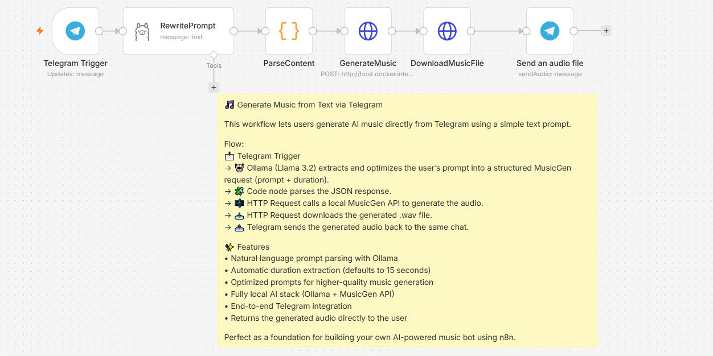
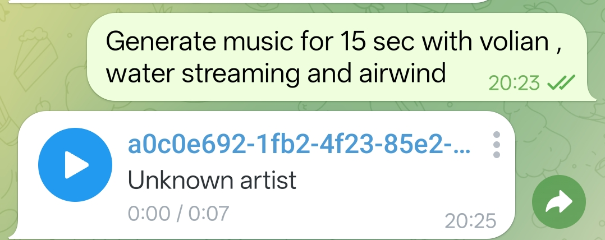

# 🎵 Telegram AI Music Generator

Generate AI music directly from Telegram using **n8n**, **Ollama**, and **Facebook MusicGen**.

This project provides an end-to-end workflow that allows users to send a text prompt through Telegram, automatically optimize it with a local LLM, generate music locally, and receive the generated audio back in Telegram.

## ✨ Features

- 🎵 Generate music from natural language prompts
- 🤖 AI-powered prompt optimization using Ollama (Llama 3.2)
- ⏱ Automatic duration extraction from user prompts
- 💬 Telegram Bot integration
- 🎼 Local MusicGen API for music generation
- 📥 Automatic audio download
- 📤 Send generated audio directly back to Telegram
- 🔒 Fully local setup (No OpenAI API required)

---

## 📋 Prerequisites

Before running this project, ensure you have:

- Docker & Docker Compose
- Python 3.11+ (if running without Docker)
- n8n
- Ollama
- Telegram Bot Token
- An internet connection (required only for the first download of the MusicGen model)
- ngrok (optional, for exposing local services)

---

## 🏗️ Workflow

```
Telegram User
      │
      ▼
Telegram Trigger
      │
      ▼
Ollama (Llama 3.2)
      │
      ▼
Parse JSON Response
      │
      ▼
MusicGen API
      │
      ▼
Download Generated Audio
      │
      ▼
Send Audio to Telegram
```

---

## 📁 Repository Structure

```
telegram-ai-music-generator/
│
├── workflow/
│   └── GenerateMusicFromText.json
│
├── screenshots/
│
├── docs/
│
├── api/
│
├── README.md
├── LICENSE
└── .gitignore
```

---

## 🚀 Technologies Used

- n8n
- Ollama
- Llama 3.2
- Facebook MusicGen
- Python
- FastAPI
- Telegram Bot API

---

## 💡 Example Prompts

```
Generate relaxing piano music

Create 20 seconds of epic battle music

Happy ukulele background music

Meditation music with birds

Cyberpunk synthwave soundtrack
```
---


## 📸 Screenshots

### n8n Workflow



### Telegram Bot



---

## 📦 Installation

1. Clone this repository.

```bash
git clone https://github.com/<YOUR_USERNAME>/telegram-ai-music-generator.git
```

2. Import the workflow from:

```
workflow/GenerateMusicFromText.json
```

3. Configure your Telegram credentials in n8n.

4. Start Ollama.

```bash
ollama run llama3.2
```

5. Start your MusicGen API.

6. Activate the workflow.

---

## 🌐 Exposing Local Services with ngrok

If you're running services locally but need them to be accessible from the internet (for example, using **n8n Cloud** or Telegram webhooks), you can expose them using **ngrok**.

### 1. Expose Ollama

Start the Ollama server:

```bash
ollama serve
```

Expose the default Ollama port (11434):

```bash
ngrok http 11434
```

You'll get a public URL similar to:

```
https://abcd1234.ngrok-free.app
```

Use this URL as your Ollama endpoint in n8n instead of:

```
http://localhost:11434
```

For example:

```
https://abcd1234.ngrok-free.app
```

---

### 2. Expose n8n (Local Installation)

If you're running n8n locally and want to receive Telegram webhooks or access it remotely, expose port **5678**:

```bash
ngrok http 5678
```

Example public URL:

```
https://wxyz5678.ngrok-free.app
```

Configure this URL wherever external access to your n8n instance is required.

---

### 3. Expose the MusicGen API (Optional)

If your MusicGen API is also running locally and needs to be accessed externally, expose port **8000**:

```bash
ngrok http 8000
```

Example:

```
https://musicgen.ngrok-free.app
```

Replace the HTTP Request node URL in the n8n workflow:

```
http://host.docker.internal:8000/generate
```

with:

```
https://musicgen.ngrok-free.app/generate
```

---

> **Note:** The free version of ngrok generates a new public URL each time you restart a tunnel. If you need a permanent URL, consider using a reserved domain with a paid ngrok plan or an alternative tunneling solution.

## 📚 Related Resources

- 💼 **LinkedIn Project Showcase:** https://www.linkedin.com/posts/vivek-bindal-8534b3102_n8n-ai-automation-share-7477735837858689025-aAWv/?utm_source=share&utm_medium=member_desktop&rcm=ACoAABoO4WtnjYvGWWu2O6oxtOHOuM

---


## 🤝 Contributing

Contributions, feature requests, and improvements are welcome.

If you find this project useful, feel free to fork it and submit a pull request.

---

## ⭐ Support

If you found this project helpful, consider giving it a ⭐ on GitHub.